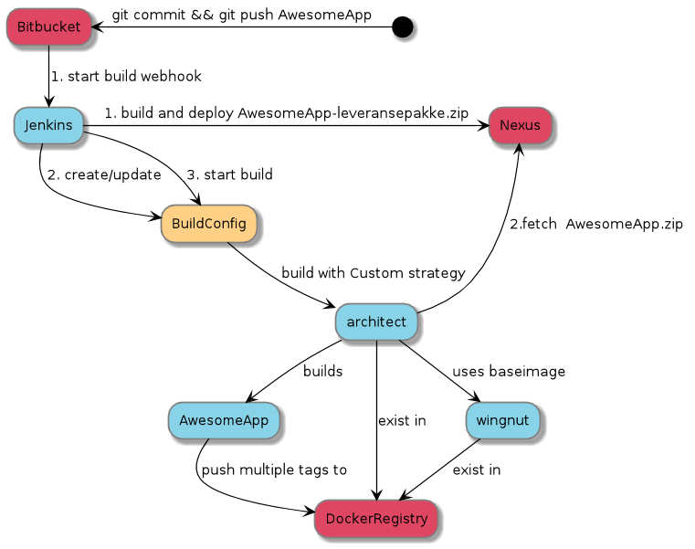

The following diagram show the flow from a developer commits and pushes code to git until the DockerImage has been built and pushed to the Docker registry.

Do you want to know more?
 * [jenkins](jenkins.html) for the details on how we build
 * [architect](architect.html)  for details on how the DockerImage is made 
 * [versioning](versioning.html) for details on how we version DockerImages and what tags we tag them with
 
 