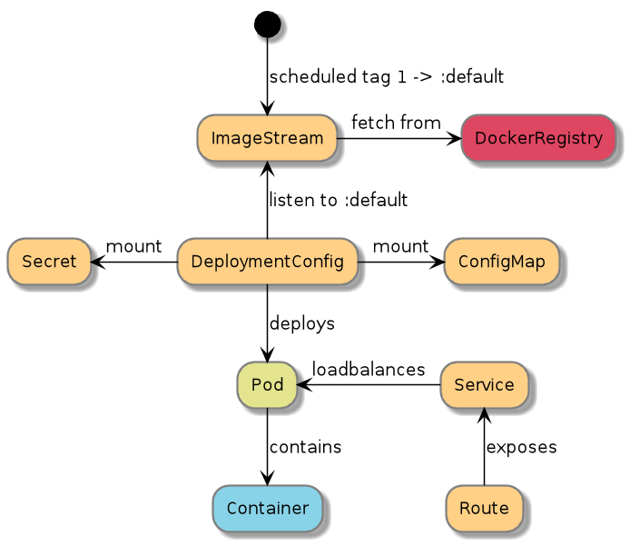

Setting up the required OpenShift objects for deploying an application is done via an api called boober.
Boober can be configured/triggered either from aoc ( a cli config tool similar to oc ) or from a Web UI.

Boober is configured using several json files that are merged together into a single json file. This json description is then transformed into OpenShift objects via provided templates and some manual fixes/tweaking.

The following features can be configured in the boober files:
 - location of the artifact in Nexus that we are deploying
 - what database schemas to generate/reuse
 - do you need a security token for secure communication?
 - config variables
 - deployment strategy, what version do you want to deploy
 - generate a route for this application
 - enable rolling upgrades
 - configure Splunk index
 - create other routes/automate opening traffic in network infrastructure (webseal/BiG-IP)
 - what version strategy you want to use

The boober process is idempotent so calling it several times will only update the required parts in the old objects.

The result of the boober process is illustrated in the diagram below. Here we are using major strategy and deploying all new releases under the 1 major tag.

## Versioning strategies
Multiple tags are [pushed for a release](versioning.html). When specifying what version to deploy in the boober configuration you can choose several different strategies.

* use the full **AuroraVersion** of a release to pin the deployment to that release. It will never be automatically bumped.
* use **latest** to always get the latest semantic release deployed
* use **SNAPSHOT-_branchname_** to get the latest build from a branch
* use *1* to get all new releases in the 1 tree, all new features and bugfixes but no breaking changes
* use *1.1* to get all new bugfixes for 1.1 release but no new features
* use *1.1.1* to get no new code, but only updates if the infrastructure changes. 

For all strategies except the first there will be triggered a new deploy if there is [infrastructure changes](patching.html) and your strategy is running the latest built release.
