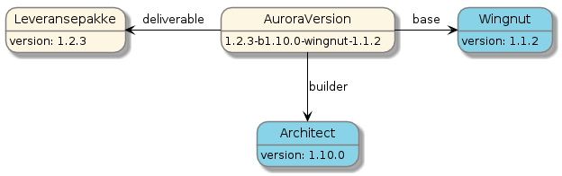
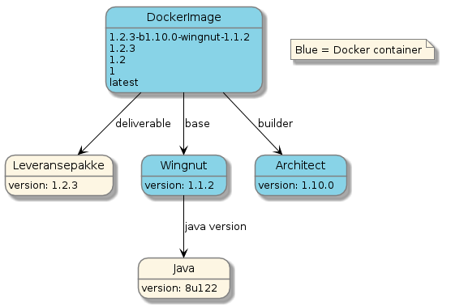

When creating docker images with a dedicated builderImage and different base image we feel it is necessary to version 
these in a way that makes it clear how to recreate the image at a later stage. The version scheme that is used can be seen 
in the following diagram

The full version number contains information about the application code, the version of the build logic, the name of the base image and the version of the base image.
It is now possible to know exactly the parts needed to rebuild it, or where to look for bugs.

When tagging a built DockerImage the rules are different based upon the kind of release
## Semantic release

## Snapshot release
When building a snapshot release you often want to just follow the latest snapshot built. In some cases you might want 
to pin it to an exact build number

The following tags are created:
 - SNAPSHOT-**APPNAME**-**buildnumber**, build number is fetched from Nexus
 -  **APPNAME**-SNAPSHOT

